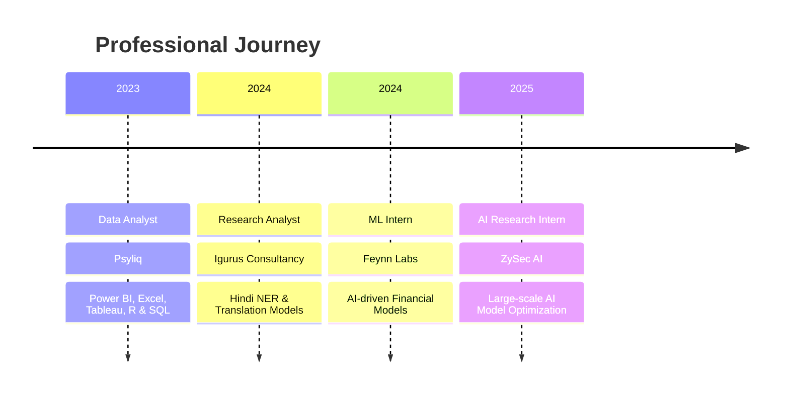
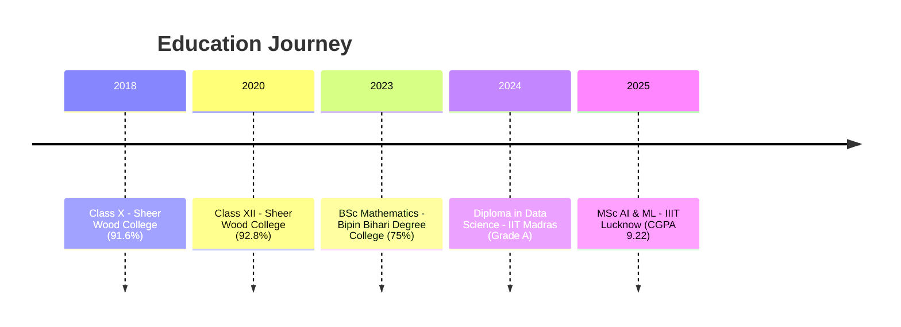

# Hey 👋, I'm Subhi Arjaria!

<div align="center">
  
</div>

<div align="center">
  
[](https://github.com/SubhiArjaria)
[](https://www.linkedin.com/in/subhi18082002/)
[](https://www.kaggle.com/)
[](https://huggingface.co/Subhi09)
[](https://x.com/SubhiArjaria09)
[](https://drive.google.com/YOUR_RESUME_LINK)

</div>

---

<div align="center">
  
  
</div>

---

## 🚀 About Me

I'm a passionate **AI/ML researcher** with a strong academic foundation and diverse project experience. From deep learning and NLP to deploying LLMs and working with real-time APIs, I enjoy exploring the boundaries of what's possible in AI.

- 🔭 Currently working on **Large Language Models** and **Security Applications**
- 🌱 Learning **Advanced AI/ML techniques** at **IIIT Lucknow**
- 👯 Looking to collaborate on **Open Source AI/ML projects**
- 💬 Ask me about **Python, Machine Learning, Deep Learning, NLP**
- 📫 How to reach me: **subhiarjaria09@gmail.com**
- ⚡ Fun fact: **I love solving coding puzzles and have solved 100+ problems!**

---

## 💼 Professional Experience



---

## 🎓 Education Timeline



---

## 🛠️ Tech Stack & Skills

<div align="center">

### 💻 Programming Languages


### 🤖 AI/ML & Data Science


### 🚀 Frameworks & Libraries


### ☁️ Cloud & DevOps


### 📊 Data Visualization & Analytics


### 🗄️ Databases & Vector Stores


</div>

---

## 🏆 Featured Projects

<div align="center">

| Project | Description | Tech Stack |
|---------|-------------|------------|
| 🪙 **Crypto Agent** | Real-time crypto analysis agent | LLaMA 3.1, Coingecko API, Streamlit |
| 📄 **AskPDF** | GenAI app for PDF analysis (200MB+) | LangChain, Streamlit, Hugging Face |
| 🎯 **Idefics 9B Fine-tuning** | Multimodal LLM fine-tuning | PEFT, 9B parameters |
| 📊 **Credit Risk Analysis** | ML models for risk prediction | XGBoost, Random Forest, 50k+ records |

</div>

---

## 🏆 Achievements & Recognition

<div align="center">

| 🎯 Achievement | 📊 Metric | 🗓️ Year |
|----------------|-----------|---------|
| 🥇 **IIT JAM Rank** | AIR 785 | 2023 |
| 📊 **Kaggle Expert** | Top 4% | 2024 |
| 🏅 **Certifications** | AI/ML from IIT Madras, Microsoft, NPTEL | 2024 |
| 💻 **Coding Problems** | 100+ solved | Ongoing |
| 🎓 **Current CGPA** | 9.22/10 | 2025 |

</div>

---

## 🎯 Current Focus Areas

```python
class SubhiArjaria:
    def __init__(self):
        self.name = "Subhi Arjaria"
        self.role = "AI/ML Researcher"
        self.education = "MSc AI & ML @ IIIT Lucknow"
        self.current_cgpa = 9.22
        
    def current_work(self):
        return [
            "🔬 AI Research @ ZySec AI",
            "🤖 Large Language Models",
            "🔐 AI for Security Applications",
            "📚 Advanced ML Research"
        ]
    
    def interests(self):
        return [
            "🧠 Deep Learning",
            "🗣️ Natural Language Processing", 
            "👁️ Computer Vision",
            "🔍 Reinforcement Learning",
            "📊 Big Data Analytics"
        ]
```

---

## 📈 Weekly Development Breakdown

<!--START_SECTION:waka-->
```text
Python           12 hrs 30 mins  ████████████████░░░░░   65.2%
Jupyter Notebook  3 hrs 45 mins  ████░░░░░░░░░░░░░░░░░   19.6%
SQL               1 hr 20 mins   ██░░░░░░░░░░░░░░░░░░░    7.0%
Markdown          45 mins        █░░░░░░░░░░░░░░░░░░░░    3.9%
YAML              30 mins        █░░░░░░░░░░░░░░░░░░░░    2.6%
Other             25 mins        █░░░░░░░░░░░░░░░░░░░░    2.2%
```
<!--END_SECTION:waka-->

---

## 🌟 Let's Connect & Collaborate!

<div align="center">

**I'm always excited to work on innovative AI/ML projects and contribute to the open-source community!**

### 📬 Get in Touch

[](mailto:subhiarjaria09@gmail.com)
[](https://www.linkedin.com/in/subhi18082002/)
[](https://github.com/SubhiArjaria)
[](https://x.com/SubhiArjaria09)

### 💡 Open to:
- 🤝 **Collaborating** on AI/ML research projects
- 🚀 **Contributing** to open-source initiatives  
- 💼 **Full-time opportunities** in AI/ML roles
- 🎓 **Research partnerships** and publications
- 🗣️ **Speaking** at tech conferences and events

</div>

---

<div align="center">
  
</div>

<div align="center">
  
</div>

---

<div align="center">
  <i>⭐ Star my repositories if you find them interesting!</i>
</div>
