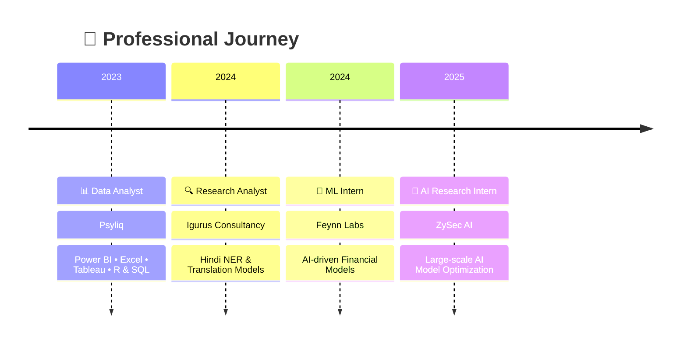
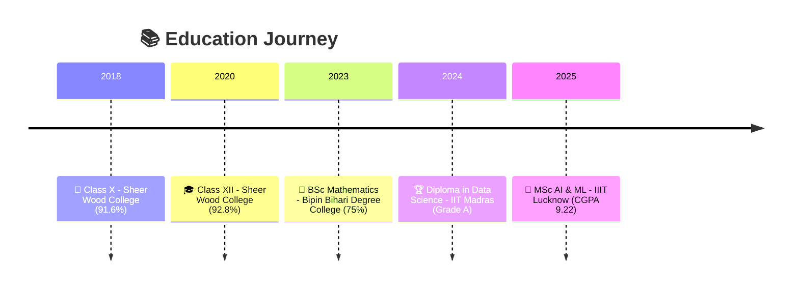

# Hey 👋, I'm Subhi Arjaria!

<div align="center">
  
</div>

<div align="center">
  
</div>

<div align="center">
  
[](https://github.com/SubhiArjaria)
[](https://www.linkedin.com/in/subhi18082002/)
[](https://www.kaggle.com/)
[](https://huggingface.co/Subhi09)
[](https://x.com/SubhiArjaria09)
[](https://drive.google.com/YOUR_RESUME_LINK)

</div>

---

<div align="center">
  
</div>

<div align="center">
  
  <br>
  
  <br>
  
</div>

<div align="center">
  
</div>

---

## 🚀 About Me


I'm a passionate **AI/ML researcher** with a strong academic foundation and diverse project experience. From deep learning and NLP to deploying LLMs and working with real-time APIs, I enjoy exploring the boundaries of what's possible in AI.

- 🔭 Currently working on **Large Language Models** and **Security Applications**
- 🌱 Learning **Advanced AI/ML techniques** at **IIIT Lucknow**
- 👯 Looking to collaborate on **Open Source AI/ML projects**
- 💬 Ask me about **Python, Machine Learning, Deep Learning, NLP**
- 📫 How to reach me: **subhiarjaria09@gmail.com**
- ⚡ Fun fact: **I love solving coding puzzles and have solved 100+ problems!**

<div align="center">
  
</div>

---

## 💼 Professional Experience

<div align="center">
  
</div>


```mermaid
timeline
    title 🚀 Professional Journey
    2023 : 📊 Data Analyst
         : Psyliq
         : Power BI • Excel • Tableau • R & SQL
    2024 : 🔍 Research Analyst
         : Igurus Consultancy
         : Hindi NER & Translation Models
    2024 : 🤖 ML Intern
         : Feynn Labs
         : AI-driven Financial Models
    2025 : 🧠 AI Research Intern
         : ZySec AI
         : Large-scale AI Model Optimization
```

<div align="center">
  
</div>

---

## 🎓 Education Timeline

<div align="center">
  
</div>


```mermaid
timeline
    title 📚 Education Journey
    2018 : 🏫 Class X - Sheer Wood College (91.6%)
    2020 : 🎓 Class XII - Sheer Wood College (92.8%)
    2023 : 📐 BSc Mathematics - Bipin Bihari Degree College (75%)
    2024 : 🏆 Diploma in Data Science - IIT Madras (Grade A)
    2025 : 🤖 MSc AI & ML - IIIT Lucknow (CGPA 9.22)
```

<div align="center">
  
</div>

---

## 🛠️ Tech Stack & Skills

<div align="center">
  
  
  
  
  
  
</div>

### 💻 Programming Languages
<div align="center">


</div>

### 🤖 AI/ML & Data Science
<div align="center">


</div>

### 🚀 Frameworks & Libraries
<div align="center">


</div>

### ☁️ Cloud & DevOps
<div align="center">


</div>

### 📊 Data Visualization & Analytics
<div align="center">


</div>

### 🗄️ Databases & Vector Stores
<div align="center">


</div>

<div align="center">
  
</div>

---

## 🏆 Featured Projects

<div align="center">
  
</div>

<div align="center">

| 🚀 Project | 📋 Description | 🛠️ Tech Stack | ⭐ Status |
|------------|-----------------|----------------|-----------|
| 🪙 **Crypto Agent** | Real-time crypto analysis agent with live data | LLaMA 3.1, Coingecko API, Streamlit | ✅ Active |
| 📄 **AskPDF** | GenAI app for PDF analysis (200MB+ files) | LangChain, Streamlit, Hugging Face | ✅ Active |
| 🎯 **Idefics 9B Fine-tuning** | Multimodal LLM fine-tuning project | PEFT, LoRA, 9B parameters | 🔄 In Progress |
| 📊 **Credit Risk Analysis** | ML models for financial risk prediction | XGBoost, Random Forest, 50k+ records | ✅ Complete |
| 🤖 **AI Security Scanner** | Automated vulnerability detection system | Python, TensorFlow, Custom Models | 🔄 Research |

</div>

<div align="center">
  
</div>

---

## 🏆 Achievements & Recognition

<div align="center">
  
</div>

<div align="center">

| 🎯 Achievement | 📊 Metric | 🗓️ Year | 🏅 Impact |
|----------------|-----------|---------|-----------|
| 🥇 **IIT JAM Rank** | AIR 785 | 2023 | Top 1% Nationally |
| 📊 **Kaggle Expert** | Top 4% | 2024 | Data Science Excellence |
| 🏅 **Premium Certifications** | AI/ML from IIT Madras, Microsoft, NPTEL | 2024 | Industry Recognition |
| 💻 **Problem Solving** | 100+ coding problems solved | Ongoing | Algorithmic Mastery |
| 🎓 **Academic Excellence** | CGPA 9.22/10 | 2025 | Research Excellence |

</div>

<div align="center">
  
</div>

---

## 🎯 Current Focus Areas

<div align="center">
  
</div>

```python
class SubhiArjaria:
    def __init__(self):
        self.name = "Subhi Arjaria"
        self.role = "AI/ML Researcher & Data Scientist"
        self.education = "MSc AI & ML @ IIIT Lucknow"
        self.current_cgpa = 9.22
        self.passion = "Building AI solutions that matter"
        
    def current_work(self):
        return [
            "🔬 AI Research @ ZySec AI",
            "🤖 Large Language Models Development",
            "🔐 AI for Cybersecurity Applications", 
            "📚 Advanced ML Research & Publications",
            "🌐 Open Source AI Contributions"
        ]
    
    def core_interests(self):
        return {
            "🧠 Deep Learning": ["Neural Networks", "Transformers", "GANs"],
            "🗣️ NLP": ["LLMs", "Text Generation", "Sentiment Analysis"],
            "👁️ Computer Vision": ["Object Detection", "Image Segmentation"],
            "🔍 Reinforcement Learning": ["Policy Optimization", "Multi-Agent"],
            "📊 Big Data": ["Distributed Computing", "Real-time Analytics"],
            "🔐 AI Security": ["Adversarial ML", "Privacy-Preserving AI"]
        }
    
    def daily_routine(self):
        return "Code 💻 → Research 📚 → Experiment 🧪 → Innovate 💡 → Repeat 🔄"
```

<div align="center">
  
</div>

---

## 📈 Weekly Development Breakdown

<div align="center">
  
</div>

<!--START_SECTION:waka-->
```text
🐍 Python           12 hrs 30 mins  ████████████████░░░░░   65.2%
📓 Jupyter Notebook  3 hrs 45 mins  ████░░░░░░░░░░░░░░░░░   19.6%
🗃️ SQL               1 hr 20 mins   ██░░░░░░░░░░░░░░░░░░░    7.0%
📝 Markdown          45 mins        █░░░░░░░░░░░░░░░░░░░░    3.9%
⚙️ YAML              30 mins        █░░░░░░░░░░░░░░░░░░░░    2.6%
🔧 Other             25 mins        █░░░░░░░░░░░░░░░░░░░░    2.2%
```
<!--END_SECTION:waka-->

<div align="center">
  
</div>

---

## 🔥 GitHub Activity Graph

<div align="center">
  
</div>

---

## 🌟 Let's Connect & Collaborate!

<div align="center">
  
</div>

<div align="center">

**🚀 I'm always excited to work on innovative AI/ML projects and contribute to the open-source community! 🚀**

### 📬 Get in Touch

[](mailto:subhiarjaria09@gmail.com)
[](https://www.linkedin.com/in/subhi18082002/)
[](https://github.com/SubhiArjaria)
[](https://x.com/SubhiArjaria09)
[](#)

### 💡 Open to:
- 🤝 **Collaborating** on cutting-edge AI/ML research projects
- 🚀 **Contributing** to impactful open-source initiatives  
- 💼 **Full-time opportunities** in AI/ML and Data Science roles
- 🎓 **Research partnerships** and academic publications
- 🗣️ **Speaking** at tech conferences and industry events
- 🎯 **Mentoring** aspiring AI/ML enthusiasts

</div>

<div align="center">
  
</div>

---

<div align="center">
  
</div>

<div align="center">
  
  
</div>

<div align="center">
  
</div>

---

<div align="center">
  <h3>🌟 <i>"Innovation distinguishes between a leader and a follower" - Steve Jobs</i> 🌟</h3>
  <p><i>⭐ Star my repositories if you find them interesting! Let's innovate together! ⭐</i></p>
</div>

<div align="center">
  
</div>
