# Hey 👋, I'm Subhi Arjaria!

<div align="center">
  
</div>

<div align="center">
  
[](https://github.com/SubhiArjaria)
[](https://www.linkedin.com/in/subhi18082002/)
[](https://www.kaggle.com/)
[](https://huggingface.co/Subhi09)
[](https://x.com/SubhiArjaria09)
[](https://drive.google.com/YOUR_RESUME_LINK)
[](mailto:subhiarjaria09@gmail.com)

</div>

---

<div align="center">
  
  
</div>

---

## 🚀 About Me


I'm a passionate **AI/ML researcher** with strong academic foundation and diverse project experience. From deep learning and NLP to deploying LLMs and working with real-time APIs, I explore the boundaries of AI possibilities.

- 🔭 Currently working on **Large Language Models** and **Security Applications**
- 🌱 Learning **Advanced AI/ML techniques** at **IIIT Lucknow**
- 👯 Looking to collaborate on **Open Source AI/ML projects**
- 💬 Ask me about **Python, Machine Learning, Deep Learning, NLP**
- 📫 Reach me: **subhiarjaria09@gmail.com**
- ⚡ Fun fact: **Solved 100+ coding problems!**

---

## 💼 Experience

```mermaid
timeline
    title Professional Journey
    2023 : Data Analyst • Psyliq
         : Power BI, Excel, Tableau, R & SQL
    2024 : Research Analyst • Igurus Consultancy
         : Hindi NER & Translation Models
    2024 : ML Intern • Feynn Labs
         : AI-driven Financial Models
    2025 : AI Research Intern • ZySec AI
         : Large-scale AI Model Optimization
```



---

## 🎓 Education


---

## 🛠️ Tech Stack

### Programming & ML


### Frameworks & Cloud


---

## 🏆 Featured Projects

| Project | Description | Tech Stack |
|---------|-------------|------------|
| 🪙 **Crypto Agent** | Real-time crypto analysis agent | LLaMA 3.1, Coingecko API, Streamlit |
| 📄 **AskPDF** | GenAI app for PDF analysis (200MB+) | LangChain, Streamlit, Hugging Face |
| 🎯 **Idefics 9B Fine-tuning** | Multimodal LLM fine-tuning | PEFT, LoRA, 9B parameters |
| 📊 **Credit Risk Analysis** | ML models for risk prediction | XGBoost, Random Forest, 50k+ records |

---

## 🏆 Achievements

| Achievement | Metric | Year |
|-------------|--------|------|
| 🥇 **IIT JAM Rank** | AIR 785 | 2023 |
| 📊 **Kaggle Expert** | Top 4% | 2024 |
| 🏅 **Certifications** | IIT Madras, Microsoft, NPTEL | 2024 |
| 💻 **Problem Solving** | 100+ solved | Ongoing |
| 🎓 **Current CGPA** | 9.22/10 | 2025 |

---

## 🎯 Current Focus

```python
class SubhiArjaria:
    def __init__(self):
        self.role = "AI/ML Researcher"
        self.education = "MSc AI & ML @ IIIT Lucknow"
        self.cgpa = 9.22
        
    def current_work(self):
        return [
            "🔬 AI Research @ ZySec AI",
            "🤖 Large Language Models",
            "🔐 AI for Security Applications",
            "📚 Advanced ML Research"
        ]
```

---

## 📈 GitHub Activity

<div align="center">
  
</div>

---

<div align="center">
  
</div>

<div align="center">
  
</div>

---

<div align="center">
  <i>⭐ Star my repositories if you find them interesting!</i>
</div>
